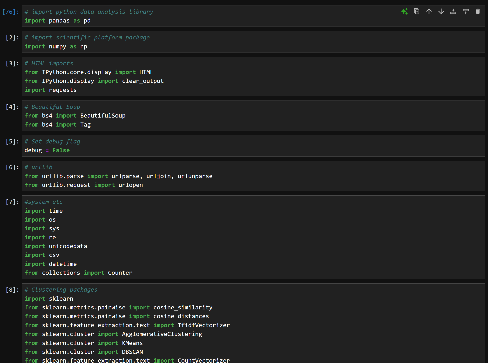
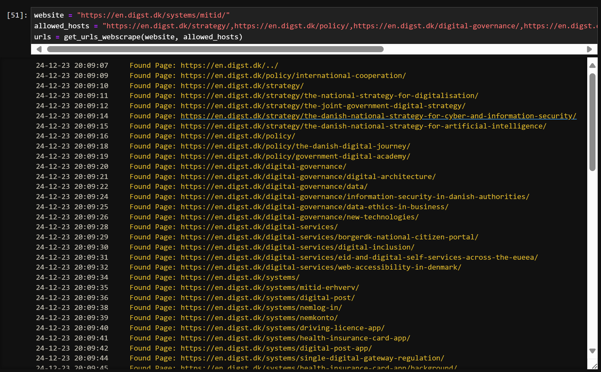
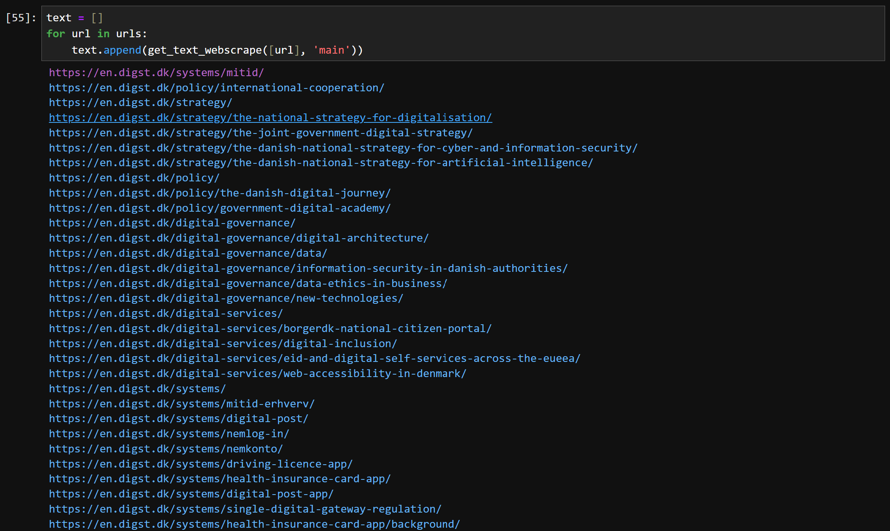
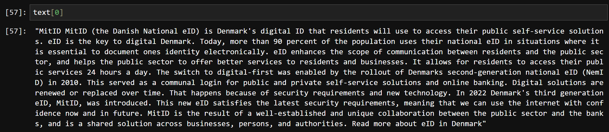
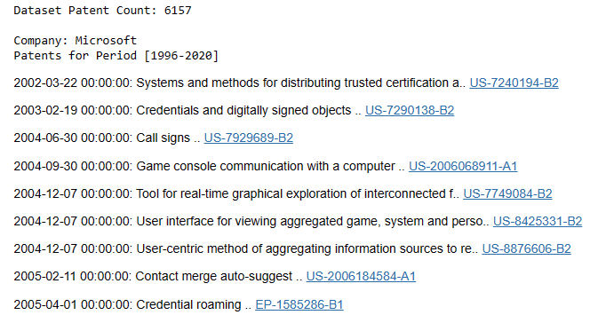
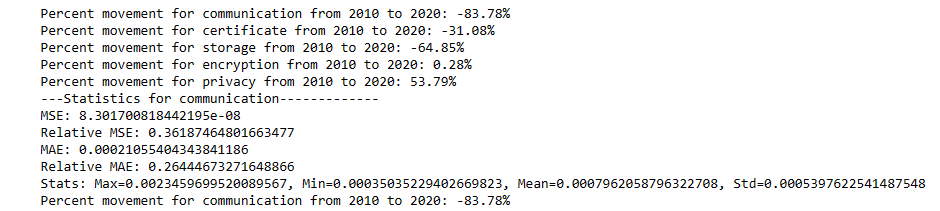
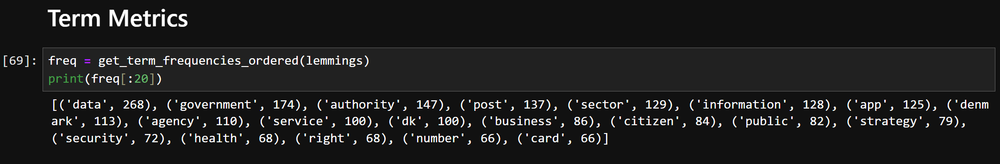
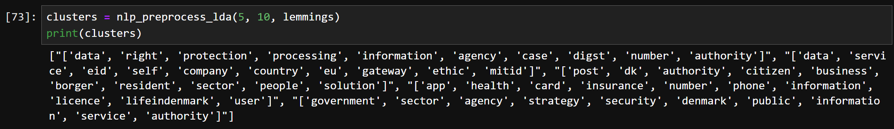

<!-- PROJECT LOGO -->
<br />
<div align="center">
    

  <h3 align="center">Mining Digital Identity Insights: Patent Analysis using NLP</h3>

  <p align="center">
    A repository with reproducibility package to accompany the published article
    <br />

  </p>
</div>


<!-- ABOUT THE PROJECT -->
## About The Project

<p>Governments globally recognise digital identity as essential for a thriving digital economy. By implementing digital identity systems, they strive to streamline citizen services, more effectively combat fraud, improve regulatory oversight, ensure accessibility for marginalised groups, and cut costs linked to conventional paper-based methods. This comprehensive approach highlights some of the many benefits of digital identity in modern governance and economic systems.</p>

<p>Implementing digital identity systems is, however, a complex challenge. The field, marked by over 6000 commercial patents filed worldwide, is now fragmented, and struggles with the significant challenge of interoperability between digital identity implementations. Currently, the landscape of digital identity is transforming owing to two key developments: the European Union's eIDAS regulatory reform, which aims to standardise electronic identification to enhance trust in online transactions, and the World Wide Web Consortium's Verifiable Credentials framework, which focuses on a decentralised approach that prioritises secure, private, and user-controlled digital identity verification. These initiatives involve a combination of centralised regulation and decentralised technology and bolster the prospects for a more unified approach to digital identity.</p>

<p>This study primarily focuses on two objectives. Firstly, it employs natural language processing to analyse the strategies and developmental stages of key government digital identity programs. Secondly, the study identifies key patterns within these programmes vital for establishing a universally relevant digital identity framework. By considering various digital identity paradigms and frameworks, the research seeks to deepen the understanding of the digital identity field and highlight effective practices that could facilitate the broader adoption of a comprehensive digital identity model.</p>

<!-- Use the `BLANK_README.md` to get started.-->

<p align="right">(<a href="#readme-top">back to top</a>)</p>


<!-- GETTING STARTED -->
## Getting Started

This is an example of how you may give instructions on setting up your project locally.
To get a local copy up and running follow these simple example steps.

### Prerequisites
The following prerequistes are required:
1. [Jupyter notebook](https://jupyter.org/)
2. [Python](https://www.python.org/)
3. Python packages: </br>


<!-- USAGE EXAMPLES -->
## Usage

In this section we will outline key commands used for the analysis. Note that more comments are available in the notebook itself

### Patent Analysis Notebook
1. Crawl Primary Page </br>
   The following command will output the top 12 entities by patent count over the given dataframe
   ```sh
   output_leaders(wd)
   ```
   
2. Mine Page </br>
   This code will display patent counts for the entire dataset, period 1996-2020 and post 2020. In addition it will output the first and last patents within the dataframe
   ```sh
   display_entity(wdfull, "Diebold", [], [])
   ```
   
3. Display Entity with Keywords </br>
   This code will display patent count metrics for each of the provided key term search words
   ```sh
   display_entity(wdfull, "Diebold", ["privacy","trust"], [])
   ```
   
4. Display Entity with Additional Ranges </br>
This code will allow you to specify a subrange e.g. in this case years that Kim Cameron was on staff
   ```sh
   display_entity(wdfull, "Microsoft", ["transaction", "game", "privacy", "trust"], [("Kim Cameron", 1999, 2011, [])])
   ```
    
5. Output Patents for Entity </br>
   This code will output a list of patents with patent hyperlinks by entity name
   ```sh
   print_all_patents(wdfull, "Microsoft")
   ```
   
### Patent Modeling Notebook
1. Model Keywords </br>
This code will output base statistics for a search term including percentage movement, mean, std, error and will also output a chart with trend over time
   ```sh
   selected_words = {'certificate','storage','privacy','communication','encryption'}  # Example set of words
   ```
   ```sh
   colors = generate_dark_colors(len(selected_words))
   ```
   ```sh
   plot_graph(selected_words, 'TF-IDF','Security',3, -0.00002)
   ```
   
   
   
   
<p align="right">(<a href="#readme-top">back to top</a>)</p>


<!-- CONTACT -->
## Contact

Matthew Comb - matthew.comb@linacre.ox.ac.uk

Project Link: [https://github.com/oxford-mc/patent-mining](https://github.com/oxford-mc/patent-mining)

<p align="right">(<a href="#readme-top">back to top</a>)</p>


<!-- ACKNOWLEDGMENTS -->
## Acknowledgments

* [Commonwealth Scholarship Commission in the UK](https://cscuk.fcdo.gov.uk/)
* [Department of Computer Science, University of Oxford](https://www.cs.ox.ac.uk/)

<p align="right">(<a href="#readme-top">back to top</a>)</p>


<!-- MARKDOWN LINKS & IMAGES -->
<!-- https://www.markdownguide.org/basic-syntax/#reference-style-links -->
[contributors-shield]: https://img.shields.io/github/contributors/othneildrew/Best-README-Template.svg?style=for-the-badge
[contributors-url]: https://github.com/othneildrew/Best-README-Template/graphs/contributors
[forks-shield]: https://img.shields.io/github/forks/othneildrew/Best-README-Template.svg?style=for-the-badge
[forks-url]: https://github.com/othneildrew/Best-README-Template/network/members
[stars-shield]: https://img.shields.io/github/stars/othneildrew/Best-README-Template.svg?style=for-the-badge
[stars-url]: https://github.com/othneildrew/Best-README-Template/stargazers
[issues-shield]: https://img.shields.io/github/issues/othneildrew/Best-README-Template.svg?style=for-the-badge
[issues-url]: https://github.com/othneildrew/Best-README-Template/issues
[license-shield]: https://img.shields.io/github/license/othneildrew/Best-README-Template.svg?style=for-the-badge
[license-url]: https://github.com/othneildrew/Best-README-Template/blob/master/LICENSE.txt
[linkedin-shield]: https://img.shields.io/badge/-LinkedIn-black.svg?style=for-the-badge&logo=linkedin&colorB=555
[linkedin-url]: https://linkedin.com/in/othneildrew
[product-screenshot]: images/screenshot.png
[Next.js]: https://img.shields.io/badge/next.js-000000?style=for-the-badge&logo=nextdotjs&logoColor=white
[Next-url]: https://nextjs.org/
[React.js]: https://img.shields.io/badge/React-20232A?style=for-the-badge&logo=react&logoColor=61DAFB
[React-url]: https://reactjs.org/
[Vue.js]: https://img.shields.io/badge/Vue.js-35495E?style=for-the-badge&logo=vuedotjs&logoColor=4FC08D
[Vue-url]: https://vuejs.org/
[Angular.io]: https://img.shields.io/badge/Angular-DD0031?style=for-the-badge&logo=angular&logoColor=white
[Angular-url]: https://angular.io/
[Svelte.dev]: https://img.shields.io/badge/Svelte-4A4A55?style=for-the-badge&logo=svelte&logoColor=FF3E00
[Svelte-url]: https://svelte.dev/
[Laravel.com]: https://img.shields.io/badge/Laravel-FF2D20?style=for-the-badge&logo=laravel&logoColor=white
[Laravel-url]: https://laravel.com
[Bootstrap.com]: https://img.shields.io/badge/Bootstrap-563D7C?style=for-the-badge&logo=bootstrap&logoColor=white
[Bootstrap-url]: https://getbootstrap.com
[JQuery.com]: https://img.shields.io/badge/jQuery-0769AD?style=for-the-badge&logo=jquery&logoColor=white
[JQuery-url]: https://jquery.com 
